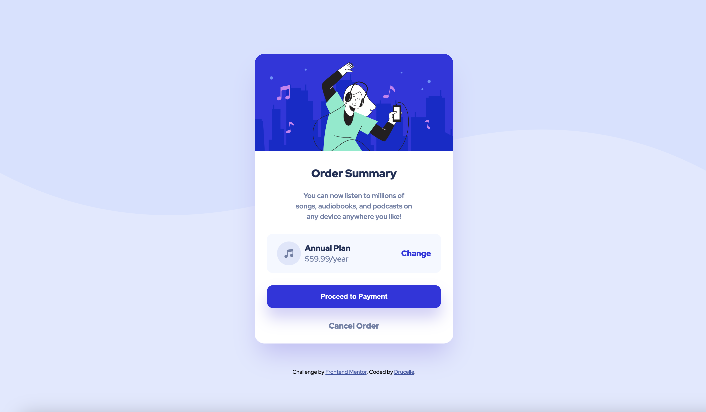

# Frontend Mentor - Order summary card solution

This is a solution to the [Order summary card challenge on Frontend Mentor](https://www.frontendmentor.io/challenges/order-summary-component-QlPmajDUj). Frontend Mentor challenges help you improve your coding skills by building realistic projects. 

## Table of contents

- [Overview](#overview)
  - [The challenge](#the-challenge)
  - [Screenshot](#screenshot)
  - [Links](#links)
- [My process](#my-process)
  - [Built with](#built-with)
  - [What I learned](#what-i-learned)
  - [Continued development](#continued-development)
  - [Useful resources](#useful-resources)
  - [AI Collaboration](#ai-collaboration)
- [Author](#author)


## Overview

### The challenge

Users should be able to:

- See hover states for interactive elements
- View the optimal layout dependig on their device screen size

### Screenshot



### Links

- Solution URL: [GitHub Repository](https://github.com/Drucelle/order-summary-component/)
- Live Site URL: [Live Demo](https://drucelle.github.io/order-summary-component/)

## My process

### Built with

- Semantic HTML5 markup
- CSS custom properties
- Flexbox
- Mobile-first workflow
- Google Fonts (Red Hat Display)
- CSS Media Queries


### What I learned

This project taught me a lot about responsive design and the mobile first approach.

**Mobile-first workflow**
I learned to always open the DevTools device toolbar when starting a project ansd set it to 320px. Starting from the smallest screen size. Then build it upward from there using 'min-width' '@media' queries.

**DevTools**
I noticed during this project that I got more comfortable using Chrome DevTools to inspect elements, debug CSS issues, and test across different screen sizes. I also learned to dock DevTools to the bottom of the screen to maximise. the vviewport width when testing.

**Flexbox**
I used and learned how to use Flexbox throughout this project to create layouts. Key properties I worked with:

``` css
display: flex;
flex-direction: column;
justify-content: center;
align-items: center;
margin-left: autto; /* pushing elements to the right */
flex: 1; /* makingg elements grow to fill available space */
```

**CSS Default Reset**

I learned and understand now why I always need to start CSS with a default reset rule set, including :eyes: :

```css
*,
*::before,
*::after {
  margin: 0;
  padding: 0;
  box-sizingg: border-box;
}
```

**CSS Custom Properties**

After the reset rule always set up a `:root` block with all my colors, fonts etc, making the code cleaner and easier to maintain:

```css
:root {
  --color-primaary-darkblue-700: hsl(245, 75%, 52%);
  --color-neutraal-grey-600: hsl(224, 23%, 55%);
  --font-family: "Red Hat Display", sans-serif;
}
```

**Media Queries**

Apart from starting with the mobile first approach I leaned to use separate media queries for taablet and desktop breakpoints, switching images and adjusting card sizing:

```css
@media (min-width: 430px){/* tablet */}
@media (min-width: 768px){/* desktop */}
```

**Terminal & Git**

I managed the entire project from the terminal, creating folders, moving files, initialising Git, and pushing to Github. I made small, meaning ful commits throughout the project.

If terminal gets stuck for whaatever reason (zsh):

- `Control + C` This stops whatever is currently running and gives you back your prompt back! :smile:

**Keyboard shortcuts for Mac learned:**
- `Shift + Option + F` Format document with Prettier
- `Cmd + Shift + R` Hard refresh in Chrome
- `Cmd + Z` Undo in VS Code

**WCAG Accesibility Requirements**

I noticed the grey text colours specified in the style guide don't fully meet WCAG AA contrast requirements. I initially thought I should flag this to the designer, but the style guide itself stated to meet WCAG requirements, so fixing it was actually part of the task. 

Running a Lighthouse audit (in DevTools) helped me identify and fix both this and a heading order issue, achieving a **100% accessibility score**.

### Continued development

In future projects I want to:

- Get more comfortable with Chrome DevTools for debugging
- Deepen my understanding of Flexbox and when to use CSS Grid instead
- Get beter at writing media queries and understand responsive design best pratices
- Improve my ability to match design pixel pefectly
- Build more confidence writing CSS
- Get more aquainted and informed on WCAG requirements 


### Useful resources

- [W3schools](https://w3schools.com) - For coding tutorials, best practices and documentation.
- [W3shools-Animated-Buttons](https://www.w3schools.com/howto/howto_css_animate_buttons.asp) Documentation on animated buttons
- [W3schools-Shadow-Box](https://www.w3schools.com/css/css3_shadows_box.asp) CSS Boxshadow
- [W3schools-media-rules](https://www.w3schools.com/cssref/atrule_media.php) CSS `@media` rules
- [MDN](https://developer.mozilla.org/) For coding best practices and documentation.
- [markdown-guide](https://www.markdownguide.org/) To learn about Markdown for e.g. Write your README.md file
- [Markdown-tutorial](https://www.markdownguide.org/getting-started/) A tutorial in writing with Markdown 
- [Coding2Go](https://www.youtube.com/watch?v=wsTv9y931o8) YouTube Chanel.Learn Flexbox in 20 minutes


### AI Collaboration

I worked Claude (Anthropic) as a coding coach and guide throughout this project.

Sometimes when I doubted my steps I would ask if the steps I was planning to take were right e.g. when I started the project setup via command line. 

Claude's role was to not give me the answers but to ask me questions that would point me in the right direction when stuck.

I have asked less questions this time around. But with the media queries Claude definitely helped me look in the right places.

Although sometimes Claude might want you to do things Claude's way. It is helpful if you familiarise yourself with reading the documentation directories like [W3schools](https://w3schools.com) and [MDN](https://developer.mozilla.org/). 

As you are the one working on the project you know what and how you want to go about it. It might take a bit longer to figure out in the beginning but it is worth it to feel confident doing so. This helps you greatly in knowing exactly what questions to ask Claude or any AI Agent to get the answers you need.


## Author

- Frontend Mentor - [@yDrucelle](https://www.frontendmentor.io/profile/Drucelle)


Thank you, for reading my whole README.md 
I know I put a lot of information here I just wanted to document and share my learnings. Might help someone?
Any suggestions in better ways to write my code are very welcome.
